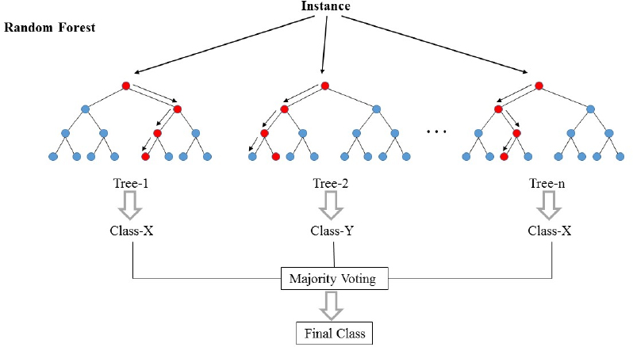

class: center, middle

# What is Machine Learning?

---

# Types of Machine Learning

- Unsupervised Learning
    - We don't have labels
- Supervised Learning
    - We have labels
- Reinforcement Learning
    - Totally different problem
        - Goal-oriented learning

---
# Unsupervised Learning Example


Source: [IotForAll](https://www.iotforall.com/machine-learning-crash-course-unsupervised-learning/)

---
# Supervised Learning Example


Source: [StatsandBots](https://blog.statsbot.co/machine-learning-algorithms-183cc73197c)

---
# Machine Learning & Ethics

- https://www.montrealdeclaration-responsibleai.com/


---
# ML Ecosystem in R


---
# Parsnip package

- Separate the definition of a model from its evaluation
- Use different packages as engines to train models
- Harmonize argument names for the same algorithms


---
class: center, middle, inverse

# Canada - Soccer Crisis

---
# Canada - Soccer Crisis

- Has only qualified for 1 World Cup in the last 33 years
    - Lost all 3 games
- In 2014 & 2018 we saw some great improvements on the team
    - 10 games won in the 2014 Qualifiers
    - 12 games won in the 2018 Qualifiers
- World Cup in 2022 & 2026
    
    
### What is the quality level of a given player?

- This helps us: 
    - Improve the quality level of teams
    - Predict how we can improve
    
---
# FIFA - How are we going to win the next World Cup?

```{r, echo=FALSE}
suppressPackageStartupMessages(library(tidyverse))
suppressPackageStartupMessages(library(GGally))
suppressPackageStartupMessages(library(hrbrthemes))

knitr::opts_chunk$set(fig.height=6, warning = FALSE, message = FALSE)

theme_set(theme_ipsum_rc(axis_title_size = 14, grid = 'XY'))
```

- Database of players from the FIFA 19 game

```{r}
fifa_data <- read_csv('data/fifa_players.csv', col_types = cols()) %>%
    mutate(quality_level = as.factor(quality_level))

head(fifa_data)
```

---
# First thing to do? Explore the data

```{r}
fifa_data %>%
    ggplot(aes(Finishing, fill = quality_level)) +
        geom_density(alpha = 0.4, colour = NA)
```

---
```{r}
fifa_data %>%
    ggplot(aes(x = ShortPassing, 
               y = Finishing, 
               colour = quality_level)) +
        geom_point(alpha = 0.7, size = 3)
```

---
```{r}
fifa_data %>%
    select(ShortPassing, Finishing, Acceleration, quality_level) %>%
    ggpairs(., mapping = aes(colour = quality_level))
```

---
# Golden Rule of Machine Learning

```{r}
library(rsample)

data_split <- fifa_data %>%
    select(-Name, - Nationality, - Position) %>%
    initial_split(., strata = 'quality_level', p = 0.75)

train_data <- training(data_split)
test_data <- testing(data_split)
```

---

```{r}
head(train_data)
```

---
# Decision Tree (Theory)


Source: [HackerNoon](https://hackernoon.com/what-is-a-decision-tree-in-machine-learning-15ce51dc445d)
---
# Decision Tree (Parsnip Interface)

```{r}
library(parsnip)
model <- decision_tree(mode = 'classification') %>%
    set_engine('rpart') %>%
    fit(quality_level ~ ., data = train_data)
```

---
# How do we know how we are doing?

```{r}
test_results <- test_data %>%
    select(quality_level) %>%
    as_tibble() %>%
    mutate(predicted = predict_class(model, new_data = test_data))

head(test_results)
```

---
# Accuracy for Decision Tree

```{r}
library(yardstick)
test_results %>%
    accuracy(truth = quality_level, estimate = 'predicted')
```

---
# Confusion Matrix for Decision Tree

```{r}
test_results %>%
    conf_mat(truth = quality_level, estimate = 'predicted')
```

---
# Random Forest (Theory)



Source: [Dimitriadis, et al.](http://www.nrronline.org/article.asp?issn=1673-5374;year=2018;volume=13;issue=6;spage=962;epage=970;aulast=Dimitriadis)
---
# Random Forest (Parsnip Interface)

```{r}
model <- rand_forest(mode = 'classification') %>%
    set_engine('ranger') %>%
    fit(quality_level ~ ., data = train_data)
```

---
# Accuracy for Random Forest

```{r}
test_results <- test_data %>%
    select(quality_level) %>%
    as_tibble() %>%
    mutate(predicted = predict_class(model, new_data = test_data))

test_results %>%
    accuracy(truth = quality_level, estimate = 'predicted')
```

---
# Confusion Matrix for Random Forest

```{r}
test_results %>%
    conf_mat(truth = quality_level, estimate = 'predicted')
```

---
# But, what about Canadian players?

```{r}
canadian_players <- fifa_data %>%
    filter(Nationality == 'Canada') 

canada_predictions <- canadian_players %>%
    select(-Name, -Nationality, -Position) %>%
    predict_class(model, new_data = .)

canadian_players %>%
    select(Name, Age, Nationality, Position, quality_level) %>%
    mutate(predictions = canada_predictions) %>%
    head()
```

---
# Things we didn't cover today

- Cross-Validation
- Deep Learning
- Regression Tasks
- Unsupervised Learning Algorithms

---
class: center, middle, inverse

# Thank You!

Email: iflores.siaca@gmail.com

GitHub: @ian-flores